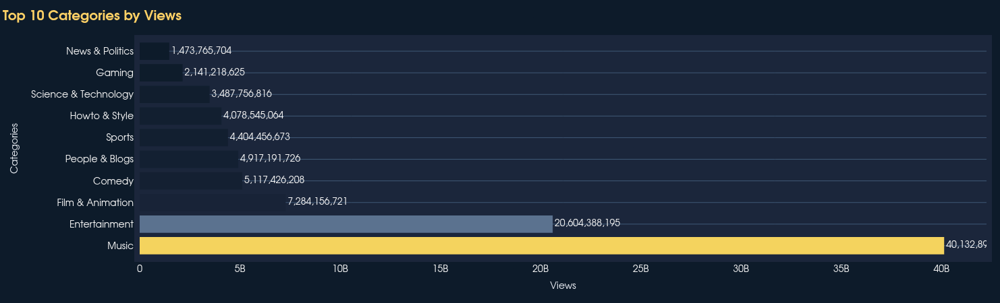
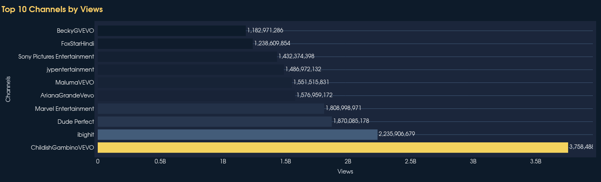
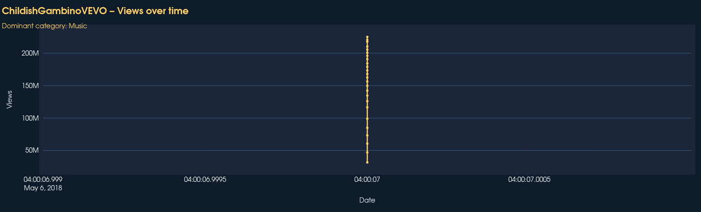
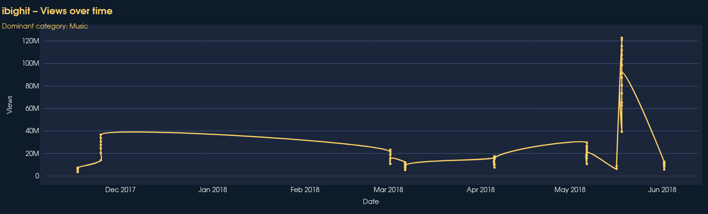
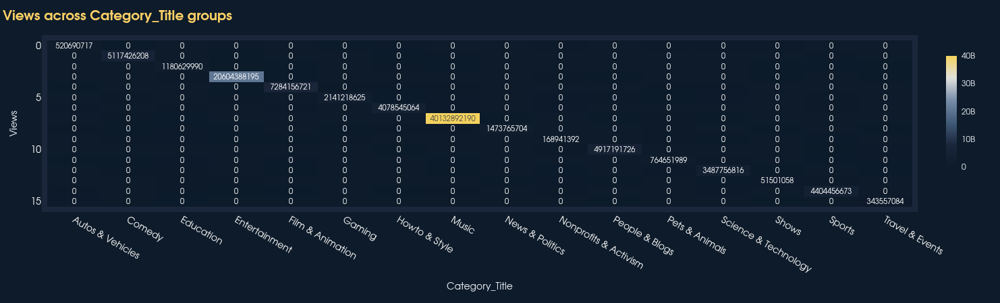
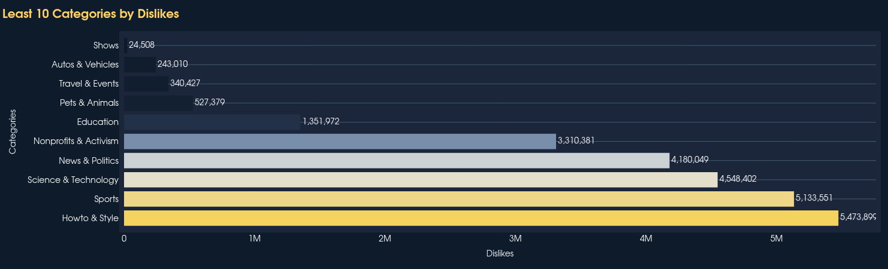
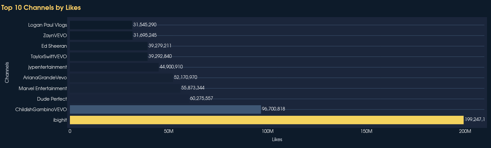

# 🇺🇸 YouTube-US Trending Analytics – Streamlit Dashboard

**Author:** Mohamed Elhasany  
**Dataset source:** [Kaggle – YouTube Trending Video Statistics (Country-specific)](https://www.kaggle.com/datasets/datasnaek/youtube-new/data)  
**Used files:** `USvideos.csv` + `US_category_id.json`  
**Language / Stack:** Python, Streamlit, Plotly, Pandas

---

## 📌 Overview

Interactive, multi-page dashboard that explores **trending YouTube videos in the United States**.  
All visuals react to **global slicers** (Metric, Group-by, Sort, Channel) so you can instantly spot:

- Top / bottom performing **categories** or **channels**
- Intensity **heat-map** of metrics
- Distribution **box-plots** (outliers, quartiles)
- Single-channel **timeline** (views, likes, comments over time)

---

## 📊 Pages

| Page                             | What it shows                   | Key insight                       |
| -------------------------------- | ------------------------------- | --------------------------------- |
| **Executive Report** (`main.py`) | KPI cards + top/bottom tables   | One-screen executive summary      |
| **Bar Chart**                    | Horizontal top-10 / bottom-10   | Where to invest promotion budget  |
| **Heat-map**                     | Metric intensity grid           | Cross-promo hot-spots             |
| **Box-Plot**                     | Distribution of Views, Likes, … | Predictability vs volatility      |
| **Timeline**                     | Line chart per channel          | Best upload timing & topic spikes |

---

## 🎛️ Global Slicers

- **Metric:** Views, Likes, Dislikes, Comments
- **Group by:** Categories ‖ Channels
- **Sort:** Ascending ‖ Descending
- **Channel:** Any single channel (for timeline)

---

### 🔑 Key Findings (with Evidence)

| Insight                                                                                  | Evidence                                                                                                                                                          | What the Image Shows                                                   |
| ---------------------------------------------------------------------------------------- | ----------------------------------------------------------------------------------------------------------------------------------------------------------------- | ---------------------------------------------------------------------- |
| **Music** owns **41.5%** of total views (40.1 B / 96.6 B)                                |                                                                                                                     | Bright-yellow bars indicating highest view counts                      |
| **Music** dominates **top-3 most-viewed channels**<br>ChildishGambinoVEVO (3.76 B views) |    | Golden stripes at ranks 1-3 showing heavy view concentration           |
| **Gaming** intensity stripe across **Views heat-map**                                    |                                                                                                                   | Dense yellow band indicating consistently high view density            |
| **Autos & Vehicles** second-lowest **Dislikes** (243 K)                                  |                                                                                                            | Short pale bar showing safe, low-hate niche                            |
| **Most-loved channel** iBigHit totals **199,247,121 likes**                              |                                                          | Bright-yellow bar showing highest like count and strong fan engagement |

---

### 📊 Business Recommendations

1. **Content Strategy**: Double-down on **Music & Entertainment** content  
   _Evidence_:

   - Music category commands **41.5%** of total views (bar chart)
   - Entertainment shows consistent high performance across metrics (heat-map)

2. **Channel Focus**: Prioritize channels in high-performing categories with consistent engagement  
   _Evidence_:
   - Top channels in Music category generate billions of views
   - iBigHit demonstrates exceptional like-to-view ratios

## 🚀 Quick Start

### 1. Clone the Repository

```bash
git clone <your-repo-url>
cd Youtube_analysis
```

### 2. Install Dependencies

### Optional: Create Virtual Environment (Recommended)

```bash
# Create virtual environment
python -m venv venv

# Activate it based on your operating system:

# Linux:
source venv/bin/activate

# macOS:
source venv/bin/activate

# Windows:
# venv\Scripts\activate

# Install packages
pip install -r requirements.txt
```

**Note:** On some Linux/macOS systems, you might need to use `python3` instead:

```bash
python3 -m venv venv
source venv/bin/activate
pip install -r requirements.txt
```

To deactivate the virtual environment when you're done:

```bash
deactivate
```

### 3. Prepare the Data

**Important:** Make sure you're in the `Youtube_analysis` folder in your terminal before proceeding.

#### Download dataset files:

1. Go to [Kaggle – YouTube Trending Video Statistics](https://www.kaggle.com/datasets/datasnaek/youtube-new/data)
2. Download these two files:
   - `USvideos.csv`
   - `US_category_id.json`
3. **Ensure you're in the project folder:**
   ```bash
   cd Youtube_analysis
   ```
4. Move both files into the raw data folder:
   ```bash
   # Copy the downloaded files to the correct location
   # Adjust the path to where you downloaded the files
   cp ~/Downloads/USvideos.csv data/raw/
   cp ~/Downloads/US_category_id.json data/raw/
   ```

#### Verify the file structure:

```bash
# Make sure you're in Youtube_analysis folder
pwd  # Should show: /path/to/Youtube_analysis

# Check the files exist
ls -la data/raw/
# Should show:
# USvideos.csv
# US_category_id.json
```

### 4. Launch the Dashboard

**Make sure you're still in the `Youtube_analysis` folder:**

```bash
# Verify your current directory
pwd  # Should be Youtube_analysis

# Launch the dashboard
streamlit run main.py
```

**Note:** If you get an error about missing files, check:

1. You're in the correct folder: `Youtube_analysis`
2. The data files are in `data/raw/`
3. File names are exactly: `USvideos.csv` and `US_category_id.json`

---

## 📁 Project Tree

Youtube_analysis/<br>
├── main.py # entry point + executive report<br>
├── pages/ # individual analysis pages<br>
│ ├── 1_Bar_Chart.py<br>
│ ├── 2_Heat-map.py<br>
│ ├── 3_Box-Plot.py<br>
│ └── 4_Timeline.py<br>
├── src/<br>
│ ├── cleaning.py # load + clean<br>
│ ├── analysis.py # prep data for plots<br>
│ ├── plotting.py # Plotly figures (dark theme)<br>
│ └── sidebar.py # reusable slicer block<br>
├── data/<br>
│ ├── raw/ # original data files<br>
│ │ ├── USvideos.csv # YouTube trending videos data<br>
│ │ └── US_category_id.json # Category mappings<br>
│ └── processed/ # cleaned data<br>
│ └── final.csv # cleaned dataset (if requested by client)<br>
├── requirements.txt # Python dependencies<br>
└── README.md # this file<br>

## 📄 License

**Dataset:** CC BY 4.0 – sourced from [Kaggle](https://www.kaggle.com/datasets/datasnaek/youtube-new/data)  
**Code:** MIT License – feel free to fork, modify, and reuse for any purpose.

## ✨ Built with ❤️ by Mohamed Elhasany

### 📧 Contact

- **Email:** [work email](elhasanymohamed123@gmail.com)
- **LinkedIn:** [Your LinkedIn Profile]
- **GitHub:** [ GitHub Profile ](https://github.com/mohamed-elhasany)
- **Portfolio:** [Your Portfolio Website]
